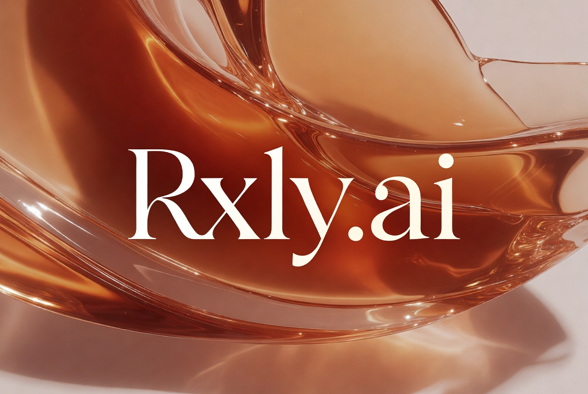
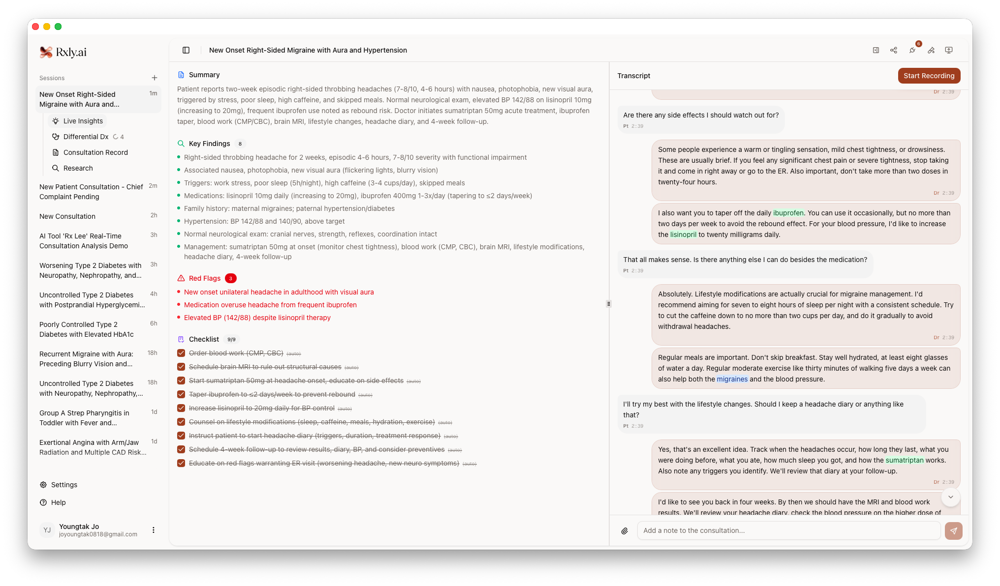

<p align="center">
  
</p>

<h1 align="center">Rxly.ai</h1>

<p align="center">
  <strong>Real-time AI-Powered Medical Consultation Assistant</strong><br/>
  Transforming patient consultations with live transcription, intelligent clinical insights, and automated medical documentation.
</p>

<p align="center">
  
  
  
  
  
</p>

<p align="center">
  <a href="https://rxly.ai"><strong>Live Demo &rarr;</strong></a>
</p>

---

## Screenshots



---

## Why Rxly?

My brother works as a firefighter in Korea. Through him, I witnessed firsthand how overwhelmed emergency rooms have become. In Korea, **emergency room capacity denial cases surged 88% year-over-year** — patients are being turned away because the system simply can't keep up.

In the United States, healthcare spending has reached **$15,474 per person annually**, consuming **18% of the nation's GDP**. Globally, healthcare costs continue to climb at every level — individuals, businesses, and governments — driven by an aging population, the rise of chronic diseases, and escalating service prices.

**We believe AI can change this.** By augmenting healthcare professionals with intelligent tools, we can dramatically increase productivity across the medical ecosystem. When doctors spend less time on documentation and more time on patients, the entire system becomes more efficient — and ultimately, **more lives are saved.**

Rxly.ai is our answer: an AI assistant that works alongside physicians in real-time, handling transcription, analysis, and documentation so they can focus on what matters most — the patient.

---

## Key Features

### Real-Time Voice Transcription
Live speech-to-text optimized for medical terminology with automatic speaker diarization. Every word of the consultation is captured accurately in real-time.

### AI Clinical Insights
Instant generation of clinical summaries, key findings, red flags, and dynamic action checklists — updated live as the conversation unfolds.

### Differential Diagnosis (DDx)
Evidence-based differential diagnoses ranked by confidence level, complete with ICD-11 classification codes and supporting clinical evidence.

### Tier 1 Medical Knowledge Integration
A RAG (Retrieval-Augmented Generation) pipeline connecting **authoritative medical sources** — including **OpenFDA, ClinicalTrials.gov, DailyMed, PubMed, and Europe PMC** — providing physicians with high-confidence, evidence-based answers at the point of care.

### Automated Medical Scribe
Structured SOAP notes (Subjective, Objective, Assessment, Plan) auto-generated from the voice conversation and physician annotations. No more hours spent on charting after clinic.

### Simulation Mode
Test and demonstrate the platform capabilities with a built-in simulation engine. Run complex clinical scenarios at up to 15x speed to verify real-time analysis without needing live actors.

### PWA Support
Install Rxly as a native-like application on desktop and mobile devices. Offline-capable architecture ensures critical functionality remains accessible.

### Intelligent Speaker Identification
AI-based automatic classification of Doctor vs. Patient speech from raw audio, enabling accurate attribution throughout the transcript.

### Multimodal Image Analysis
Upload medical images during a consultation for context-aware AI analysis — correlated with the ongoing conversation, patient history, and clinical findings.

### EMR/EHR Integration
FHIR R4-compliant data export for seamless interoperability with electronic health record systems.

---

## Built with Claude

> **100% of the codebase was built using Claude Opus** via [Claude Code](https://claude.ai/code).
>
> All AI reasoning and clinical intelligence features are powered by **Claude Opus 4.6** and **Claude Sonnet 4.5** — from real-time clinical analysis and differential diagnosis to medical record generation and research assistance.

---

## How It Works

```
┌─────────────┐     ┌──────────────────┐     ┌──────────────────┐     ┌─────────────────────────┐
│  Microphone  │────▶│  Speech-to-Text   │────▶│  Live Transcript  │────▶│   AI Analysis Engine     │
└─────────────┘     └──────────────────┘     └──────────────────┘     │                         │
                                                                       │  ┌─ Clinical Insights    │
                                                                       │  ├─ Differential Dx      │
                                                                       │  ├─ Medical Record (SOAP)│
                                                                       │  └─ Research Assistant   │
                                                                       └─────────────────────────┘
```

1. **Record** — The physician starts a consultation and Rxly begins live transcription with speaker diarization.
2. **Analyze** — AI processes the transcript in real-time, generating insights, flagging red flags, and suggesting differential diagnoses.
3. **Document** — A complete SOAP note is automatically drafted, ready for physician review and EMR export.
4. **Research** — Physicians can query the built-in research assistant, backed by 6 medical knowledge sources, for evidence-based answers during the consultation.

---

## Getting Started

### Prerequisites

- Node.js 18+
- PostgreSQL database
- API keys for AI, speech-to-text, and authentication services

### Installation

```bash
# Clone the repository
git clone https://github.com/your-username/rxly.git
cd rxly

# Install dependencies
npm install

# Set up environment variables
cp .env.example .env
# Edit .env with your API keys
```

### Environment Variables

```env
# Database
DATABASE_URL=
DIRECT_URL=

# Authentication
NEXT_PUBLIC_SUPABASE_URL=
NEXT_PUBLIC_SUPABASE_ANON_KEY=
SUPABASE_SERVICE_ROLE_KEY=

# AI
ANTHROPIC_API_KEY=
XAI_API_KEY=

# Speech-to-Text
DEEPGRAM_API_KEY=

# Medical Data
ICD11_CLIENT_ID=
ICD11_CLIENT_SECRET=
NCBI_API_KEY=

# Email
RESEND_API_KEY=
RESEND_FROM_EMAIL=

# EMR
MEDPLUM_BASE_URL=
MEDPLUM_CLIENT_ID=
MEDPLUM_CLIENT_SECRET=

# App
NEXT_PUBLIC_APP_URL=
```

### Run

```bash
# Run database migrations
npx prisma migrate dev

# Start the development server
npm run dev
```

Open [http://localhost:3000](http://localhost:3000) to see the application.

---

## Security & Privacy

Rxly.ai implements technical safeguards in preparation for HIPAA compliance:

- **AES-256-GCM Encryption** — All Protected Health Information (PHI) is encrypted at rest in the database
- **Comprehensive Audit Logging** — Every data access and modification is recorded with full audit trails
- **Content Security Policy** — Strict CSP headers prevent XSS and injection attacks
- **Rate Limiting** — API endpoints are rate-limited to prevent abuse
- **Prompt Injection Protection** — All user inputs are sanitized before reaching AI models
- **Transport Security** — HSTS headers enforce HTTPS connections

> **Note:** Rxly.ai is implementing technical safeguards aligned with HIPAA requirements. A Business Associate Agreement (BAA) is not currently in place.

---

## License

This project is licensed under the [MIT License](LICENSE).
