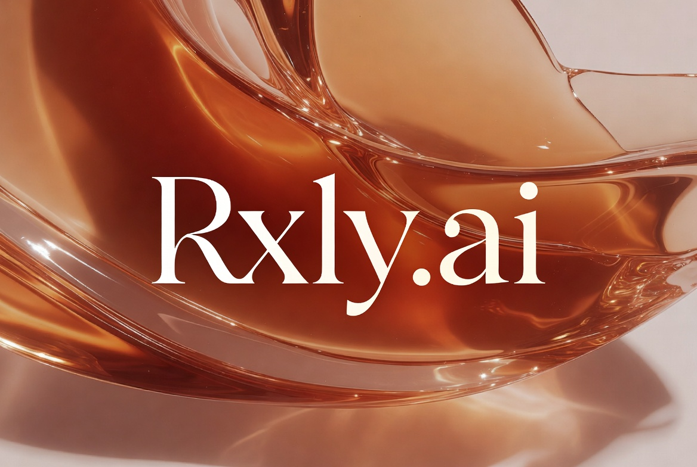
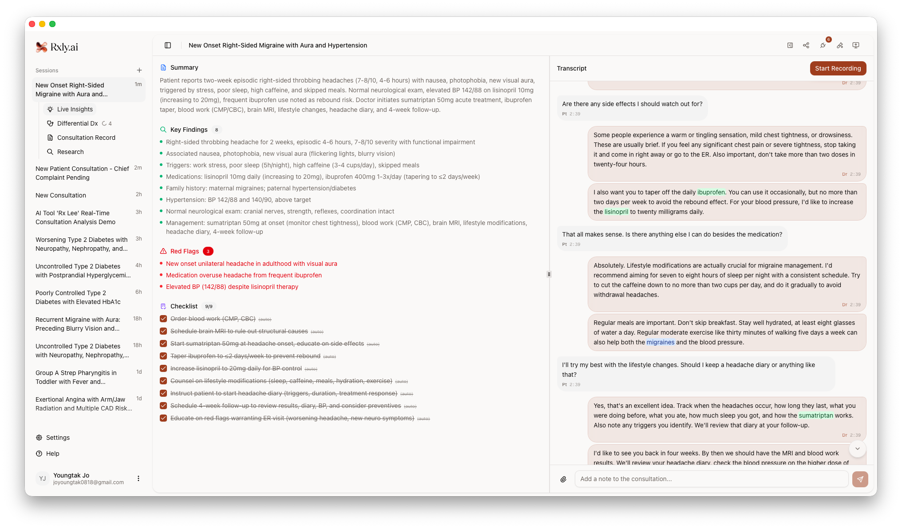

<p align="center">
  
</p>

<h1 align="center">Rxly.ai</h1>

<p align="center">
  <strong>Real-time AI medical consultation assistant</strong><br/>
  Live transcription, clinical insights and draft records that a physician reviews during the visit.
</p>

<p align="center">
  
  
  
</p>

<p align="center">
  <a href="https://rxly.ai"><strong>Live Demo &rarr;</strong></a>
</p>

I was one of 500 participants selected from roughly 13,000 applicants for Anthropic's Built with Opus 4.6 Claude Code hackathon. I developed Rxly alone during the hackathon and submitted it. After the submission, I continued development until March 2026.

The prototype has not undergone clinical validation or a compliance audit.

- Project write-up: [youngtakjo.com/en/projects/rxly](https://youngtakjo.com/en/projects/rxly)
- Hackathon submission: [Built with Opus 4.6 gallery](https://cerebralvalley.ai/e/claude-code-hackathon/hackathon/gallery/96)

---

## Screenshots



---

## Why Rxly?

My brother works as a firefighter in Korea. Through him, I saw firsthand how overwhelmed emergency rooms have become.

Rxly focuses on one part of clinical work: turning a consultation into a usable record. While listening to a patient, a physician also has to identify key information, remember follow-up questions and prepare documentation for after the visit. I built an assistant that prepares draft records and items to review as the conversation unfolds. I worked through clinical requirements with physicians practicing in the US and focused on a workspace they can use during the consultation.

---

## Key Features

### Real-Time Voice Transcription

Live speech-to-text with speaker diarization. English uses Deepgram's Nova-3 Medical model; other languages use Nova-3. Interim results are handled separately from finalized utterances.

### Speaker Role Identification

Speech is first grouped by speaker. The conversation content is then used to assign doctor and patient roles, and a speaker stays unidentified until a role is assigned.

### AI Clinical Insights

Clinical summaries, key findings, red flags and action checklists update as the conversation continues. Checked items, physician notes and manually added items are kept when new suggestions arrive.

### Differential Diagnosis (DDx)

Differential-diagnosis candidates are ranked by confidence and carry ICD-11 codes and links to the sources retrieved for them. The model can still suggest candidates when retrieval returns nothing, so appearing in the list does not mean a candidate has been verified.

### Medical Knowledge Sources

A retrieval pipeline queries five medical knowledge sources (OpenFDA, ClinicalTrials.gov, DailyMed, PubMed and Europe PMC) in parallel, with ICD-11 lookup alongside them. Sources that return results are passed to the model with titles and links for citation. A slow or failed source does not block the others.

### Draft Medical Records

Structured SOAP notes (Subjective, Objective, Assessment, Plan) are drafted from the transcript, physician notes and the existing draft. Editable document templates add their own fields, and templates with a diagnosis field can require a confirmed diagnosis.

### Simulation Mode

A built-in simulation replays sample consultations at up to 4x speed. It is used to inspect transcription, analysis updates, pausing and resuming, and session switching without a live conversation.

### Multimodal Image Analysis

Images uploaded during a consultation are analyzed together with the conversation and earlier image findings.

### FHIR Export with Review

The app prepares a FHIR R4 bundle, shows it for review, and then sends it to Medplum. This provides an export format and connector; interoperability with a hospital EMR has not been validated.

### Installable Web App

A web app manifest lets supporting browsers install Rxly on desktop and mobile.

## How It Works

```
┌─────────────┐     ┌──────────────────┐     ┌──────────────────┐     ┌─────────────────────────┐
│  Microphone  │────▶│  Speech-to-Text   │────▶│  Live Transcript  │────▶│   AI Analysis Engine     │
└─────────────┘     └──────────────────┘     └──────────────────┘     │                         │
                                                                       │  ┌─ Clinical Insights    │
                                                                       │  ├─ Differential Dx      │
                                                                       │  ├─ Medical Record (SOAP)│
                                                                       │  └─ Research Assistant   │
                                                                       └─────────────────────────┘
```

1. **Record:** The physician starts a consultation and Rxly begins live transcription with speaker diarization.
2. **Analyze:** The AI processes the transcript as it grows, generating insights, flagging red flags and suggesting differential diagnoses.
3. **Document:** A SOAP note is drafted for the physician to review, edit and export.
4. **Research:** Physicians can query the built-in research assistant, backed by five medical knowledge sources (OpenFDA, ClinicalTrials.gov, DailyMed, PubMed, Europe PMC) and ICD-11 lookup, during the consultation.

---

## Getting Started

### Prerequisites

- Node.js 20.9+
- PostgreSQL database
- API keys for AI, speech-to-text, and authentication services

### Installation

```bash
# Clone the repository
git clone https://github.com/Youngtak-Jo/rxly_h.git
cd rxly_h

# Install dependencies
npm install

# Set up environment variables
cp .env.example .env
# Edit .env with your API keys
```

### Environment Variables

```env
# Database
DATABASE_URL=
DIRECT_URL=

# Authentication
NEXT_PUBLIC_SUPABASE_URL=
NEXT_PUBLIC_SUPABASE_ANON_KEY=
SUPABASE_SERVICE_ROLE_KEY=

# AI
ANTHROPIC_API_KEY=
XAI_API_KEY=
OPENAI_API_KEY=

# Speech-to-Text
DEEPGRAM_API_KEY=

# Medical Data
ICD11_CLIENT_ID=
ICD11_CLIENT_SECRET=
NCBI_API_KEY=

# Email
RESEND_API_KEY=
RESEND_FROM_EMAIL=

# EMR
MEDPLUM_BASE_URL=
MEDPLUM_CLIENT_ID=
MEDPLUM_CLIENT_SECRET=

# App
NEXT_PUBLIC_APP_URL=

# Security (HIPAA)
PHI_ENCRYPTION_KEY=
```

### Run

```bash
# Run database migrations
npx prisma migrate dev

# Start the development server
npm run dev
```

Open [http://localhost:3000](http://localhost:3000) to see the application.

---

## Security & Privacy

Rxly implements technical controls informed by HIPAA requirements:

- **AES-256-GCM field encryption:** Clinical text fields are encrypted before they are written to the database.
- **Audit logging:** Most API routes record create, read, update and delete actions with the user and resource.
- **Security headers:** Every route sets a Content Security Policy, HSTS, X-Frame-Options and related headers.
- **Rate limiting:** Most API routes apply per-user request limits.
- **Custom-instruction filtering:** A physician's custom instructions are capped at 2,000 characters and discarded if they match known prompt-injection patterns before they are added to the system prompt.

> **Note:** These controls do not substitute for clinical validation or a compliance audit. A Business Associate Agreement (BAA) is not in place.
